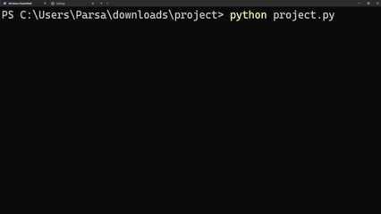

<div align = "center">

# Password Manager Tool 

</div>


## Description
### This program is a command-line tool designed to help you save and manage passwords locally; It offers several other features such as checking whether your password has been found in a leak, generating passwords, etc.  


## Dependencies
### The program makes use of [InquirerPy](https://inquirerpy.readthedocs.io/en/latest/) and [Rich](https://rich.readthedocs.io/en/stable/), to provide the user an interface in the terminal; [InquirerPy]((https://inquirerpy.readthedocs.io/en/latest/)) is a library that allows for interactive menus such as multiple choice menus, checkboxes, and hidden user input for password entries. [Rich]((https://rich.readthedocs.io/en/stable/)) is a library that allows for colored syntax, tabular data, and themes.
### Furthermore, [Requests](https://requests.readthedocs.io/en/latest/), a library for sending HTTP Requests easily. It is used in this project alongside the [Have I Been Pwned (HIBP) API](https://haveibeenpwned.com/api/v3#PwnedPasswords) in order to check whether a password has been found in a leak [(more on this here)].

## Installation
### Install the third-party libraries used in the program by running this:
```
pip install requests InquirerPy rich
```

## Program Flow

Start<br>
│<br>
▼<br>
[open_vault()](#open_vault) → [validate_masterpass()](#validate_masterpass)<br>
│<br>
▼<br>
Main Menu<br>
├── [add_credentials()](#add_credentials)<br>
├── [get_credentials()](#get_credentials)<br>
├── [list_credentials()](#list_credentials)<br>
├── [edit_credentials()](#edit_credentials)<br>
├── [delete_credentials()](#delete_credentials)<br>
├── [check_credentials()](#check_credentials)<br>
├── [generate_credentials()](#generate_credentials)<br>
└── Exit

## Functions
## `main()`
### At the start of the program the user is prompted to choose a master password which is used to edit, delete, and get other passwords. [`validate_masterpass()`](#validate_masterpass) is responsible for ensuring the passwords meets the requirements.

## `open_vault()`
### Upon running the program, `open_vault()` is ran creating an empty JSON file used later for writing the credentials into.

## `add_credentials()`
### This function prompts the user for a service name, username, and password and after verifying that they are non-empty strings, saves it to the vault which is a dict of dicts.

## `get_credentials()`
### Returns the credentials of the selected service.

## `list_credentials()`
### Returns all of the saved credentials with service names. 

## `edit_credentials()`
### Allows the user to make changes to a chosen service.

## `delete_credentials()`
### Allows the user to delete a service of choice.

## `check_credentials()`
### Prompt the user for a password to check and makes use of the [HIBP API](https://haveibeenpwned.com/api/v3#PwnedPasswords) to check whether the password has been found in a data breach or not.  

## `generate_credentials()`
### Presents the user with 4 checkboxes (Uppercase, Lowercase, Digits, and Special characters) and generates a password with a length of 16 with the selected factors.

## Helper functions (called by other functions):

## `validate_masterpass()`
### Called in the beginning of [`main()`](#main) in order to check whether the masterpass meets the requirements of a strong password:
- ### 12 characters in length
- ### Include 2 digits
- ### Include 4 letters
- ### Include 1 uppercase letter
- ### Include 1 lowercase letter
- ### Include 1 special character

## `check_masterpass()`
### Called in the beginning of [`get_credentials()`](#get_credentials), [`list_credentials()`](#list_credentials), [`edit_credentials()`](#edit_credentials), and [`delete_credentials()`](#delete_credentials) in order to verify the enterred masterpass matches the original masterpass. 

## `call_to_action()`
### Uses the InquirerPy library to present the user with 8 choices, the user can naviagte the options with up/down keys and press enter to select. Called after every operation is over.

## `select_service()`
### Presents the user with the saved services, used in [`get_credentials()`](#get_credentials), [`edit_credentials()`](#edit_credentials), and [`delete_credentials()`](#delete_credentials) in order to select the service.

## `save_vault()`
### Called automatically at the end of program in order to write the vault into a JSON file.


## Have I Been Pwned?
### [HIBP](https://haveibeenpwned.com/) is a service that lets you check if your email or password has appeared in known data breaches. Its documentation contains an [API](https://haveibeenpwned.com/api/v3#PwnedPasswords) that lets developers make use of the platform and check passwords.
### The [API](https://haveibeenpwned.com/api/v3#PwnedPasswords) expects the first 5 hashed characters of the password in [SHA-1](https://en.wikipedia.org/wiki/SHA-1) format, it compares it against its databse and returns all the hashes with the same 5 character prefix alongside with a count in this format:
### `<Hash>:<Count>`
### for example:
### `0018A45C4D1DEF81644B54AB7F969B88D65:1`
### All of these hashes are then looped through and the full hash is checked against the user's hashed password, if a match is found the program returns a message alerting the user of leaks alongside with a count of how many times the password appears in known data breaches.
## Example Usage
### When ran with "123456" which is the [world's most common password](https://www.cyberpilot.io/cyberpilot-blog/the-most-common-passwords), this is what the program outputs.
<div align="center">
  
</div>

## License
Copyright 2025 Mohammadparsa Talebibarmi

Permission is hereby granted, free of charge, to any person obtaining a copy of this software and associated documentation files (the “Software”), to deal in the Software without restriction, including without limitation the rights to use, copy, modify, merge, publish, distribute, sublicense, and/or sell copies of the Software, and to permit persons to whom the Software is furnished to do so, subject to the following conditions:

The above copyright notice and this permission notice shall be included in all copies or substantial portions of the Software.

THE SOFTWARE IS PROVIDED “AS IS”, WITHOUT WARRANTY OF ANY KIND, EXPRESS OR IMPLIED, INCLUDING BUT NOT LIMITED TO THE WARRANTIES OF MERCHANTABILITY, FITNESS FOR A PARTICULAR PURPOSE AND NONINFRINGEMENT. IN NO EVENT SHALL THE AUTHORS OR COPYRIGHT HOLDERS BE LIABLE FOR ANY CLAIM, DAMAGES OR OTHER LIABILITY, WHETHER IN AN ACTION OF CONTRACT, TORT OR OTHERWISE, ARISING FROM, OUT OF OR IN CONNECTION WITH THE SOFTWARE OR THE USE OR OTHER DEALINGS IN THE SOFTWARE.
